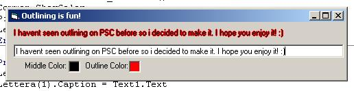



## Outlining in VB

### Description

I havent seen a Outlineing text on PSC so i decided to make one i hope you find some use for it.. it really makes text look cool if you expiriment with it. Anyway comment or vote please!
 
### More Info
 

             |
---                |---
**Submitted On**   |2004-11-01 20:48:50
**By**             |[x sAGE x](https://github.com/Planet-Source-Code/PSCIndex/blob/master/ByAuthor/x-sage-x.md)
**Level**          |Beginner
**User Rating**    |5.0 (10 globes from 2 users)
**Compatibility**  |VB 6\.0
**Category**       |[Miscellaneous](https://github.com/Planet-Source-Code/PSCIndex/blob/master/ByCategory/miscellaneous__1-1.md)
**World**          |[Visual Basic](https://github.com/Planet-Source-Code/PSCIndex/blob/master/ByWorld/visual-basic.md)
**Archive File**   |[Outlining\_1813291112004\.zip](https://github.com/Planet-Source-Code/x-sage-x-outlining-in-vb__1-57054/archive/master.zip)

